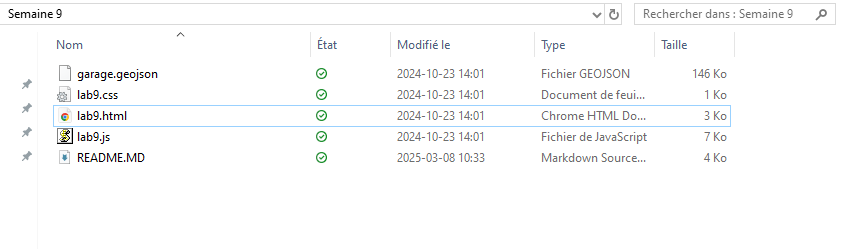
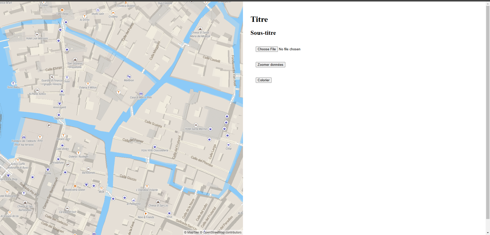
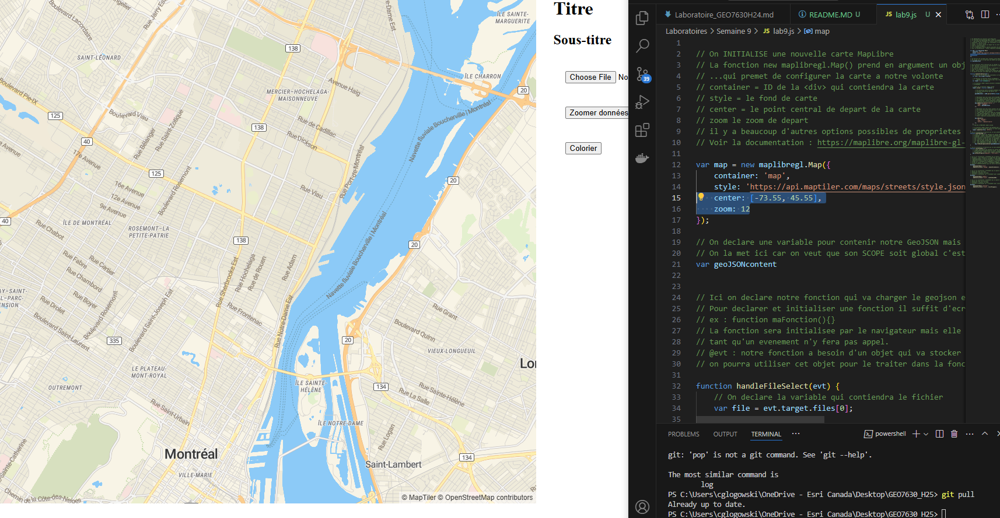
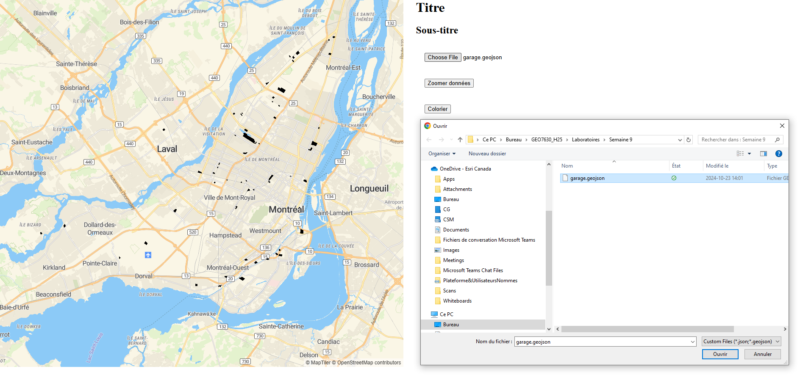
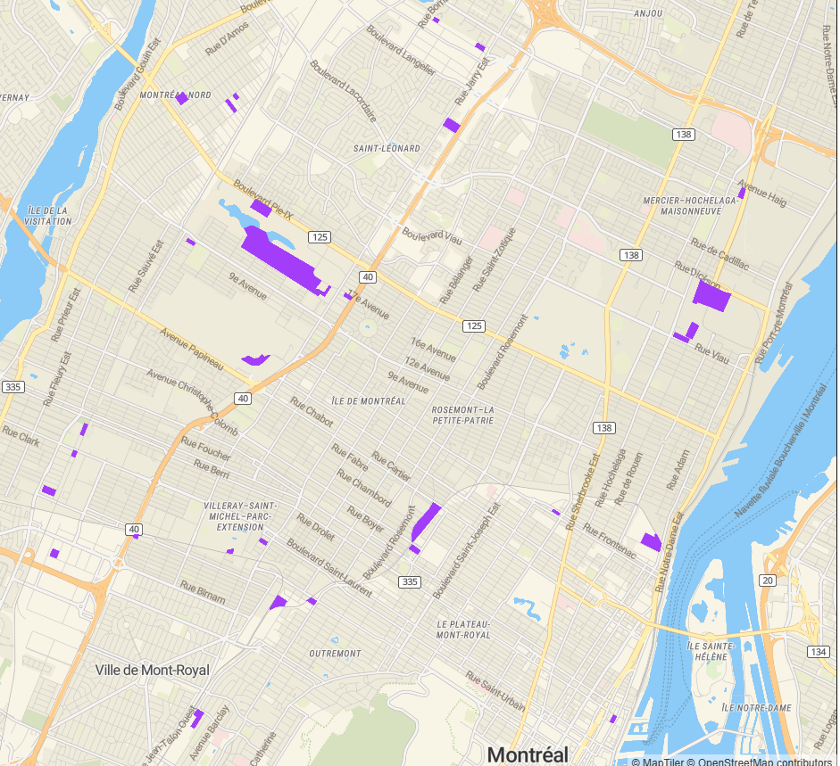
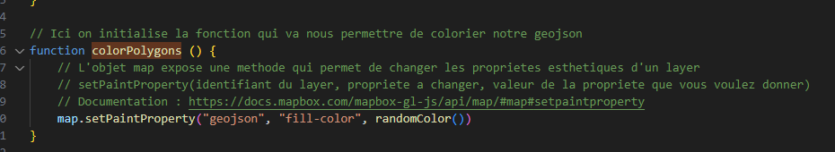
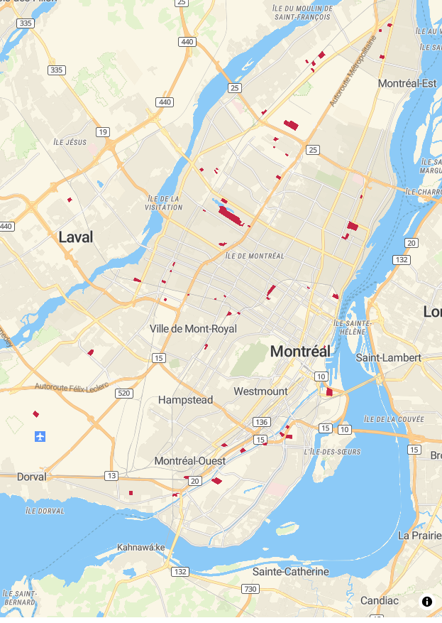
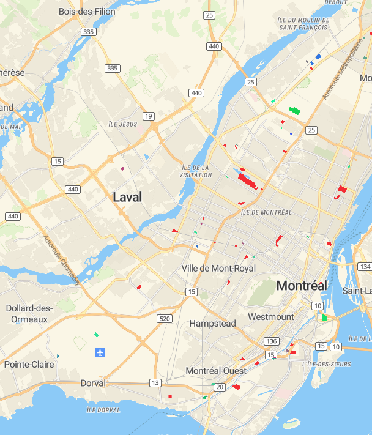
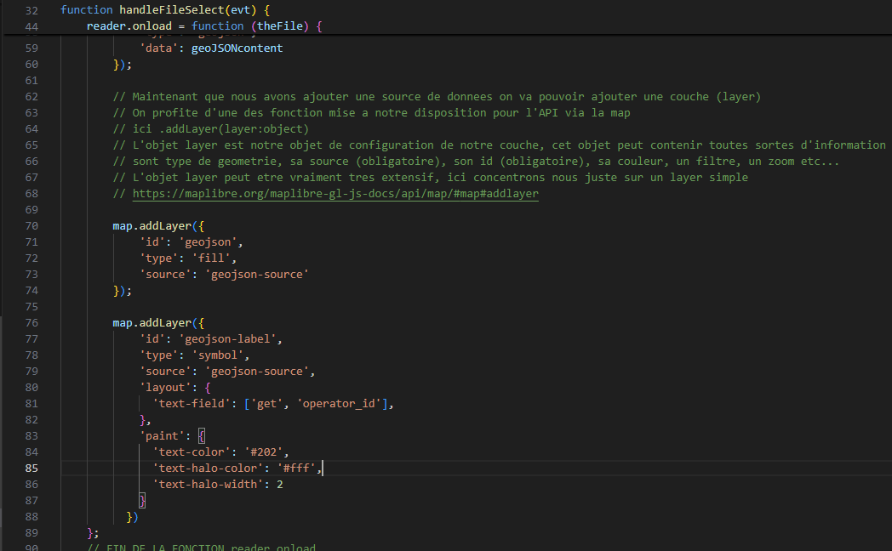
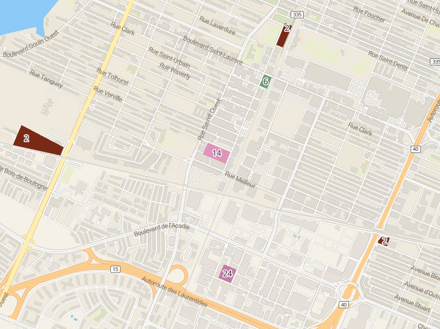

# 🛰 Laboratoire 9 : Webmapping Open Source et interaction avec MapLibreGL

## 🛠 Prérequis

✅ Visual Studio installé et configuré.

✅ Compte GitHub connecté à Visual Studio.

✅ Navigateur Web supportant les technologies modernes (Chrome, Firefox, Edge).

## 📋 Objectifs du laboratoire

Ce laboratoire vous permettra d’explorer le webmapping open source à travers MapLibreGL, une librairie JavaScript permettant d’afficher des cartes interactives. Vous apprendrez à :

- Modifier les coordonnées de départ de l’application.

- Modifier la couleur des polygones.

- Créer une fonction pour générer des couleurs aléatoires.

- Assigner des couleurs thématiques en fonction des attributs.

- Ajouter une couche d’étiquettes.

- Utiliser GitHub pour versionner votre code.

## 🗂 Clonage du projet

Cloner le repository GitHub en utilisant Visual Studio ou la ligne de commande :

`git clone https://github.com/Captain-Oski/GEO7630_H25`

Créez ensuite une branche personnelle pour vos modifications.

`git checkout -b votre_nom-labo9`

## 🌍 Chargement de l'application

Accédez au répertoire du laboratoire 9.



Ouvrez le fichier index.html et vérifiez que l’application charge correctement.




## Modification du code

### 1.1 Modifier les coordonnées de départ

Dans le fichier lab9.js, localisez et modifiez les coordonnées et le niveau de zoom par défaut :

`[-73.55, 45.55]`  // Coordonnées originales

Changez-les par d'autres valeurs et sauvegardez.

Testez votre modification en rechargeant (F5) la page web.



### 1.2 Ajout du GeoJSON 

Avec le bouton déjà préparé, ajoutez le fichier GeoJSON



Les polygones sont bien chargés, mais avec une symbologie par défaut.

### 2. Modifier la couleur des polygones

Dans la fonction colorPolygons() (ligne 96) du fichier .js , changez :

`'color': 'red'`

par :

`'color': '#9f40ff'` (notation Hexadécimale des couleurs)

#### Testez avec le bouton Colorier.



### 3. Créer une fonction de couleur aléatoire

Créez un nouveau fichier randomColor.js et insérez le code suivant :

```
function randomColor() {
  var r = Math.floor(Math.random() * 256);
  var g = Math.floor(Math.random() * 256);
  var b = Math.floor(Math.random() * 256);
  return "#" + ((1 << 24) + (r << 16) + (g << 8) + b).toString(16).slice(1);
}
```

Ajoutez-le dans index.html :

`<script type='text/javascript' src='./randomColor.js'></script>`

### 4. Appliquer une couleur aléatoire aux polygones

Modifiez la fonction colorPolygons() pour utiliser randomColor() à la place de la couleur codé en dur :

` 'color': randomColor() `

#### Rechargez la page et testez.




### 5. Ajouter une coloration thématique

Remplacez **randomColor()** par une symbologie thématique basé sur l’attribut `operator_id` :

```
{
  property: 'operator_id',
  stops: [
    [2, randomColor()],
    [3, randomColor()],
    [15, randomColor()],
    [20, randomColor()],
    [25, randomColor()],
    [30, randomColor()]
  ]
 }
```

En MapLibreGL, cet extrait de code est utilisé pour définir une règle de style conditionnelle basée sur la propriété `operator_id` d’un ensemble de données géospatiales (comme un GeoJSON ou une couche de tuiles vectorielles).

#### Explication du code

- 1️⃣ property: 'operator_id'
👉 Indique que la couleur sera déterminée en fonction de l’attribut `operator_id` des entités dans la couche, mais cela pourrait être n'importe quel attribut.
Chaque entité possède une valeur spécifique pour `operator_id` qui sera comparée aux valeurs des stops.

- 2️⃣ stops: [...]
👉 Définit une échelle de correspondance entre les valeurs de `operator_id` et des couleurs aléatoires.

Chaque élément de stops est une paire dans un tableau : **[valeur, couleur]** :

Si operator_id == 2, la couleur sera randomColor().
Si operator_id == 3, la couleur sera randomColor().
Si operator_id == 15, la couleur sera randomColor()
…etc.

- 3️⃣ randomColor()
👉 Appelle une fonction générant une couleur aléatoire en hexadécimal (#RRGGBB).
Chaque valeur de `operator_id` recevra une couleur différente à **chaque rechargement**.

### 6. Utilisation dans un style MapLibreGL
Ce type de paramètre est souvent utilisé dans la propriété fill-color d’un layer de type `fill` pour colorier des polygones en fonction de l’attribut `operator_id` :

```
map.addLayer({
  'id': 'garages-layer',
  'type': 'fill',
  'source': 'geojson-source',
  'paint': {
    'fill-color': [
      'match',
      ['get', 'operator_id'], 
      2, randomColor(),
      3, randomColor(),
      15, randomColor(),
      20, randomColor(),
      25, randomColor(),
      30, randomColor(),
      '#000000' // Couleur par défaut si aucune correspondance
    ],
    'fill-opacity': 0.8
  }
});
```

### Explication du match dans MapLibreGL :

- ['get', 'operator_id'] : Récupère la valeur de operator_id pour chaque entité.
- Chaque paire valeur, couleur affecte une couleur aux polygones ayant cette valeur.
- Couleur de fallback #000000 si operator_id n’est pas dans la liste.

### Résultat attendu
- Chaque polygone dans la carte sera coloré en fonction de son operator_id.
- La couleur sera aléatoire à chaque exécution de l’application.
- Une valeur operator_id inconnue recevra la couleur noire (#000000).



### 7. Ajouter des étiquettes aux polygones

Dans la fonction `handleFileSelect` (ligne 32) injectez le morceau de code suivant à la fin (après la méthode map.addLayer()) pour permettre l'ajout d'un nouveau layer d'étiquettes à vos polygones de garages :

```
map.addLayer({
  'id': 'geojson-label',
  'type': 'symbol',
  'source': 'geojson-source',
  'layout': {
    'text-field': ['get', 'operator_id'],
  },
  'paint': {
    'text-color': '#202',
    'text-halo-color': '#fff',
    'text-halo-width': 2
  }
})
```

### Rechargez et testez.



## 8.  Versionnement avec GitHub

Vérifiez les fichiers modifiés :

`git status`

Ajoutez-les à la mise en attente :

`git add .`

Faites un commit :

git commit -m "Mise à jour du Laboratoire 9"

Poussez vos changements :

git push origin votre_nom-labo9

🏆 Félicitations !

Vous avez complété ce laboratoire avec succès ! 🚀