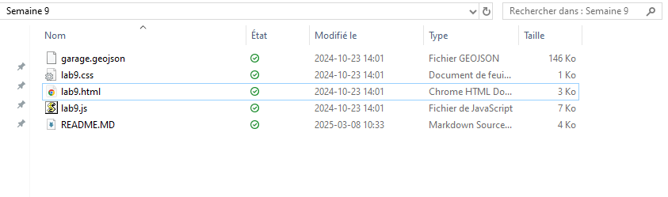
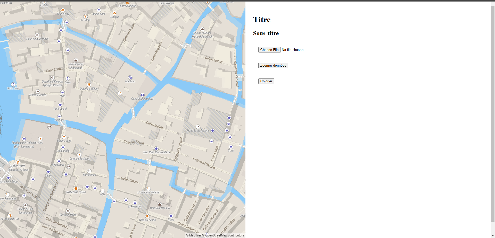
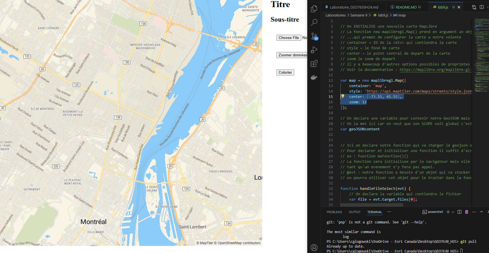
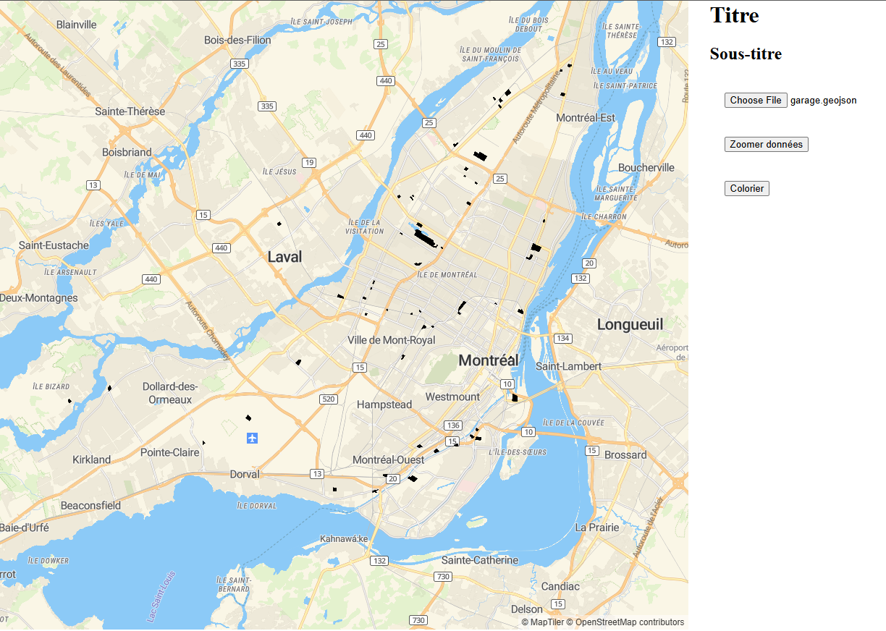
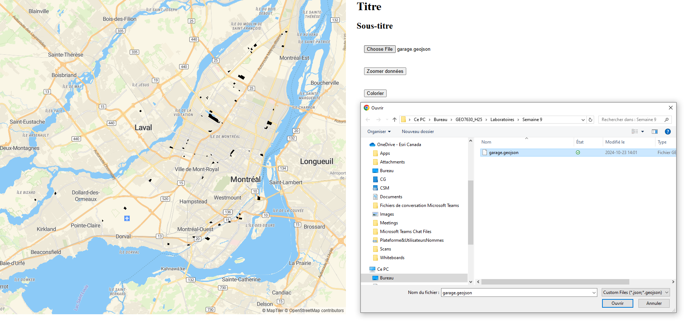
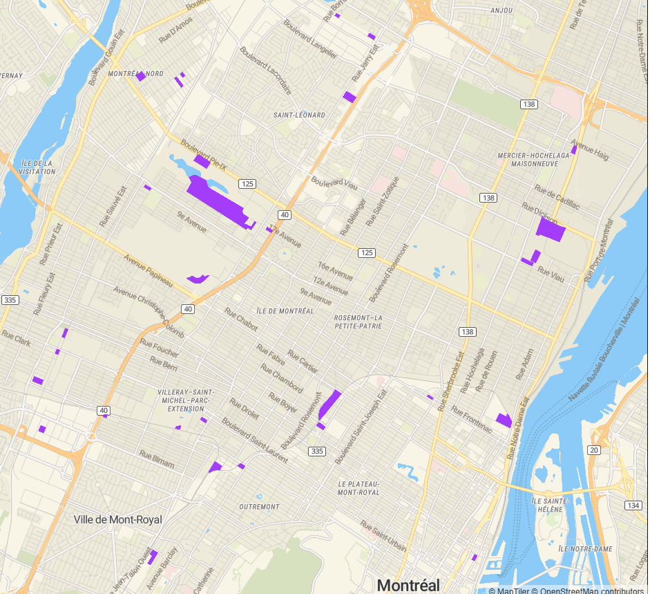

# Laboratoire 10 - geo7630h26
## Configuration Geoserver et mise en place de services VTS et WFS

### **Étape 1 : Configuration et lancement d’une instance de Geoserver**

1. Ouvrez GitHub et assurez-vous d’être connecté
2. Lancez un Codespace à partir de votre fork du dépot github du cours (sur la branche main le codespace).
3. Cela démarre un environnement virtuel où vous pourrez modifier et tester du code, ainsi que démarrer des services cartographiques.




---

### **Étape 2 : Configuration de l’environnement**

1. Copiez-collez le fichier **.env.example** situé dans le dossier **Atlas** (dans le même dossier).
2. Renommez le fichier en **.env** (supprimez le **.example**).
3. Modifiez les variables d’environnement avec vos informations personnelles :

   ```plaintext
   DB_USER=CODEPERMANENT
   DB_PASSWORD=VOTREMOTDEPASSE
   DB_HOST=geo7630.c124ic8ew2kc.ca-central-1.rds.amazonaws.com
   DB_NAME=geo7630h26
   ```

4. Dans le dossier **Atlas**, faites un clic droit sur le fichier **docker-compose.yml** et sélectionnez **Compose Up**.



5. Si l’option **Compose Up** n’apparaît pas, installez l’extension **Docker**. (Ctrl+shift+x cherchez Docker)



6. Vérifiez que les conteneurs s’exécutent correctement en consultant l’icône de la baleine Docker.



7. Ouvrez un terminal (**CTRL+J**) et testez l’application en accédant à son interface web.

---

### **Étape 3 : Ajout de contrôles de carte**

Dans le fichier **/Atlas/app/app.js**, ajoutez les contrôles suivants :

- **Contrôle de navigation** :
  ```javascript
  var nav = new maplibregl.NavigationControl({
      showCompass: true,
      showZoom: true,
      visualizePitch: true
  });
  map.addControl(nav, 'top-right');
  ```
- **Contrôle de géolocalisation** :
  ```javascript
  var geolocateControl = new maplibregl.GeolocateControl({
      positionOptions: { enableHighAccuracy: true },
      trackUserLocation: true
  });
  map.addControl(geolocateControl, 'bottom-right');
  ```
- **Contrôle d’échelle** :
  ```javascript
  var scale = new maplibregl.ScaleControl({ unit: 'metric' });
  map.addControl(scale);
  ```
Rechargez la page pour voir les contrôleurs s’afficher.



Voici tous les différents Markers and Controls pour votre carte 

https://maplibre.org/maplibre-gl-js/docs/API/#markers-and-controls


---

### **Étape 4 : Chargement de données depuis un serveur de tuiles vectorielles**

#### 1. 


Une source de tuiles vectorielles est définie par une URL qui suit le schéma {z}/{x}/{y}.pbf, où :
- z représente le niveau de zoom
- x et y représentent les coordonnées de la tuile
- ! Attention la source doit être déclarée avant d’ajouter une couche qui l’utilise.

#### 1. Accédez à l’interface d’administration du serveur de tuiles (par exemple pg_tileserv).
#### 2. Recherchez le service de tuiles vectorielles correspondant à votre couche.
1. Cliquez sur JSON

2. Repérez l'url en bas et n'oubliez pas de changer le début de l'adresse du serveur pour votre adresse e.g : `special-train-gv4r9g5gj4cvp7`


#### 3. Copiez l’URL du service et remplacez-la dans le script.

#### 4. Utilisation du source-layer

Le source-layer correspond au nom de la couche à afficher à partir du service de tuiles.
Il est essentiel d’utiliser le bon nom, qui est défini dans la configuration du serveur de tuiles.
- Voir la propriété name du .json du service


Vous pouvez maintenant : 
#### 5. Ajoutez la méthode **map.onLoad()** dans **app.js** :
- Pour plus d'information assurez-vous de voir la documentation du code dans app.js

```javascript
map.on('load', function () {
    map.addSource('NOM UNIQUE QUE VOUS SOUHAITEZ DONNER À VOTRE SOURCE', {
        type: 'vector',
        tiles: ['https://your-server-url/PROPRIÉTÉ IS DE LA SOURCE.JSON/{z}/{x}/{y}.pbf']
    });
    map.addLayer({
        'id': 'IDENTIFIANT UNIQUE DU LAYER QUE VOUS SOUHAITEZ DONNER ',
        'type': 'fill',
        'source': 'NOM QUE VOUS AVEZ DONNÉ À VOTRE SOURCE',
        'source-layer': 'PROPRIÉTÉ IS DE LA SOURCE.JSON'
    });
});
```

Exemple : 

```javascript
map.on('load', function () {
    map.addSource('qt_arbres_quartier_source', {
        type: 'vector',
        tiles: ['https://special-train-gv4r9g5gj4cvp7-8801.app.github.dev/public.densite_arbres_quartiers/{z}/{x}/{y}.pbf']
    });
    map.addLayer({
        'id': 'qt_arbres_quartier',
        'type': 'fill',
        'source': 'qt_arbres_quartier_source',
        'source-layer': 'public.densite_arbres_quartiers'
    });
});
```

#### 6. Rechargez la carte pour voir les données s'afficher.

Vérification et dépannage

Si les tuiles ne s’affichent pas :
- Vérifiez que le service de tuiles est bien public et accessible.


- Assurez-vous que l’URL utilisée est correcte.
- Ouvrez la console du navigateur (F12 > Console) pour vérifier s’il y a des erreurs.
- Testez l’URL dans un navigateur pour voir si les tuiles sont bien générées.


---

### **Étape 5 : Stylisation**

Ajoutez une propriété **paint** pour modifier le rendu :
! Attention les propriétés du layer sont séparées par des virgules.

```javascript
'paint': {
    'fill-color': '#FF0000',
    'fill-opacity': 0.5
}
```


---

### **Étape 6 : Style avancé**

Appliquez un style basé sur une interpolation linéaire de la propriété `qt_arbres`:

```javascript
'paint': {
    'fill-color': [
        'interpolate',
        ['linear'],
        ['get', 'qt_arbres'],
        0, 'rgb(255, 255, 255)',
        100, 'rgba(192, 192, 255, 0.64)',
        1000, 'rgba(46, 46, 255, 0.58)',
        5000, 'rgba(68, 0, 255, 0.66)',
        7000, 'rgba(19, 0, 70, 0.66)'
    ],
    'fill-opacity': 0.7
}
```


---

### **Étape 7 : Ajout d’une couche WFS**

0. Utilisez FME pour charger les limites d'arrondissements dans votre schéma de bases de données (nommer la table aussi simplement que `arrondissements`)

Ensuite

1. **Rendez le port 9000 (pg_featureserv) public** pour trouver et copier l'URL du service WFS des arrondissements (comme vu en cours)


2. Ajoutez une fonction **loadWFS()** dans **app.js** :

```javascript
/**
 * Fonction qui génère une couleur aléatoire en format hexadécimal.
 * @returns {string} Couleur générée au format hexadécimal.
 */
function getRandomColor() {
    // Définition des caractères hexadécimaux possibles
    var letters = '0123456789ABCDEF';
    // Initialisation de la couleur avec le préfixe hexadécimal (#)
    var color = '#';
    // Boucle pour générer chaque caractère de la couleur (6 caractères)
    for (var i = 0; i < 6; i++) {
        // Sélection aléatoire d'un caractère hexadécimal
        color += letters[Math.floor(Math.random() * 16)];
    }
    // Retourne la couleur générée au format hexadécimal
    return color;
}

/**
 * Fonction qui charge une couche WFS depuis pgFeatureServ et l'ajoute à la carte MapLibre.
 * Cette fonction ajoute une source de données GeoJSON à partir d'une URL pgFeatureServ
 * et ajoute une couche de remplissage ('fill') à la carte MapLibre en utilisant cette source de données.
 */
function loadWFS() {
    // Ajout de la source de données des arrondissements depuis pgFeatureServ
    map.addSource('arrondissements-source', {
        type: 'geojson', // Type de source de données
        data: 'UNE URL GeoJSON qui fini par .json' // URL pgFeatureServ GeoJSON ! Attention il faut bien inclure la méthode qui fait la requete sans limite d'items de données
    });

    // Ajout de la couche des arrondissements à la carte MapLibre
    map.addLayer({
        'id': 'arrondissements', // Identifiant de la couche
        'type': 'fill', // Type de géométrie de la couche (remplissage)
        'source': 'arrondissements-source', // Source des données de la couche
        'paint': {
            'fill-outline-color': 'black',
            'fill-color': getRandomColor(), // Si la condition est vraie, utilisez une couleur aléatoire
            'fill-opacity': 0.3 // Opacité de remplissage (30%)
        }
    });
}
```
exemple de map.addSource pour pg_featureServ
```
 map.addSource('arrondissements-source', {
        type: 'geojson', // Type de source de données
        data: 'https://special-train-gv4r9g5gj4cvp7-9000.app.github.dev/collections/public.arrondissements/items?limit=5000' // URL pgFeatureServ GeoJSON ! Attention il faut bien inclure la méthode qui fait la requete sans limite d'items de données
    });
```

3. **Ajoutez un bouton HTML** pour déclencher la fonction :

```html
<div class='map-overlay top' >
    <button type="button" class="btn btn-primary" onclick="loadWFS()">Load WFS Data</button>
</div>
```


Rechargez la page et cliquez sur le bouton pour afficher la couche WFS.


---

Vous pouvez ajouter cette propriété au layer WFS pour qu'il se loge hierarchiquement en dessous du layer des quartiers.

        'before': 'qt_arbres_quartier' // This ensures that 'arrondissements' is placed beneath 'qt_arbres_quartier'

### **Conclusion**

Vous avez maintenant une configuration fonctionnelle de pg_tileserv et pg_featureserv avec des services VTS et WFS intégrés à une application MapLibreGL. La semaine prochaine, nous aborderons :

- Les filtres dynamiques
- Le déplacement automatisé
- Les événements de souris (popup et interactions avancées)
- La visualisation avancée

