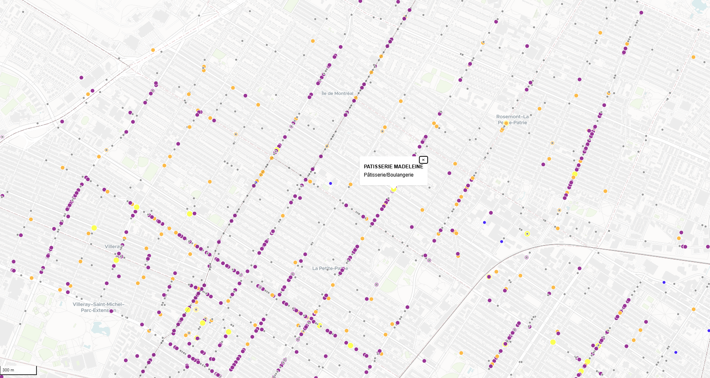

# 🧪 Lab 11 – Cartographie interactive avec MapLibreGL

Ce laboratoire NE vous guide étape par étape dans la construction d'une **application web de cartographie interactive**.

Il vous donne l'architecture de l'application et vous donne les grandes étapes

---

## 1 Fichiers du laboratoire

- `index.html` : point d’entrée HTML
- `map-controls.js` : création et configuration de la carte
- `map-layers.js` : définition des sources et couches
- `app.js` : chargement dynamique des couches dans la carte
- `mouse-controls.js` : interactions avec la souris (hover, click)

---

## 1 Étape 1 – Initialisation de la carte

📄 Fichier : `map-controls.js`

Créez un fichier `map-controls.js` et injecter y la carte et les controleurs de carte (var map = new maplibregl.Map , var control = map.NavigationControl(...) etc...)
- Création de la carte MapLibreGL
- Définition du fond de carte via MapTiler
- Ajout des contrôles :
  - Navigation (zoom + boussole)
  - Géolocalisation
  - Échelle

---

##  Étape 2 – Ajout des couches de données

📄 Fichier : `map-layers.js`


Créez un fichier `map-layers.js` et créer les layers sous forme de variable objet :

ex :

```
// Définition de la source GeoJSON
var commercesSource = {
    type: 'geojson',
    data: 'https://donnees.montreal.ca/dataset/c1d65779-d3cb-44e8-af0a-b9f2c5f7766d/resource/ece728c7-6f2d-4a51-a36d-21cd70e0ddc7/download/businesses.geojson'
  };
  
  // Définition de la couche avec symbologie par type de commerce
  var commercesLayer = {
    id: 'commerces',
    type: 'circle',
    source: 'commerces_source'
    etc....
  };

```


1. **Commerces** :
   - Source GeoJSON dynamique depuis Montréal Source GeoJSON via données ouvertes ou pgfeatureserv ou pgtileserv
   ex : `https://donnees.montreal.ca/dataset/c1d65779-d3cb-44e8-af0a-b9f2c5f7766d/resource/ece728c7-6f2d-4a51-a36d-21cd70e0ddc7/download/businesses.geojson`
   - Couleur et taille variables selon le `type` de commerce

Configuration souhaitée :

```
 paint: {
      // Rayon variable selon le type
      'circle-radius': [
        'match',
        ['get', 'type'],
        'Épicerie', 5,
        'Pâtisserie/Boulangerie', 7,
        'Distributrice automatique', 4,
        'Pharmacie', 6,
        'Restaurant', 5,
        3 // taille par défaut
      ],
      // Couleur variable selon le type
      'circle-color': [
        'match',
        ['get', 'type'],
        'Épicerie', 'orange',
        'Pâtisserie/Boulangerie', 'yellow',
        'Distributrice automatique', 'blue',
        'Pharmacie', 'green',
        'Restaurant', 'purple',
        'grey' // couleur par défaut
      ],
      'circle-stroke-color': '#fff',
      'circle-stroke-width': 1
    }
```

   - Filtrage pour ne garder que ceux au statut `"Ouvert"` (Ajoutez le à la suite du "paint" configuration)

```
    filter: ['==', ['get', 'statut'], 'Ouvert']
```


2. **Arrondissements** :
   - Source GeoJSON via données ouvertes ou pgfeatureserv ou pgtileserv
   - Polygones avec contour noir, remplissage semi-transparent
   - Labels centrés par arrondissement sur la propriété : `nom`

```
 layout: {
      'text-field': ['get', 'nom'], // ou 'nom_offici'
      'text-font': ['Open Sans Bold', 'Arial Unicode MS Bold'],
      'text-size': 14,
      'text-anchor': 'center'
    },
    paint: {
      'text-color': '#111',
      'text-halo-color': '#fff',
      'text-halo-width': 1.5
    }
```

---

## Étape 3 – Chargement des couches dans la carte

📄 Fichier : `app.js`

Créez un fichier `app.js` et injecter les layers précédement créer dans le `map-layers.js`

- Ajout des sources et des couches :
  - `commerces_source` → `commerces`
  - `arrondissements-source` → `arrondissements`, `arrondissements-labels`
---

## Étape 4 – Ajout des interactions souris

📄 Fichier : `mouse-controls.js`

Créez un fichier `mouse-controls.js` et injecter y les controleurs de souris

- Survol (`mouseenter` / `mouseleave`) : changement du curseur
- Clic sur un commerce :
  - Affiche une popup (nom + type)
  - Effectue un zoom et un recentrage (`flyTo`)

---

## Étape 5 – Extension possible

💡 Pistes d’amélioration :
- Ajouter un sélecteur `<select>` pour filtrer dynamiquement les types de commerces
- Ajouter des statistiques ou un mini dashboard avec les comptes par arrondissement
- Créer un panneau latéral dynamique avec les propriétés des entités sélectionnées

---

## Résultat attendu


Une carte interactive centrée sur Montréal :

- Affiche les commerces filtrés et stylisés
- Montre les arrondissements nommés
- Offre une interaction fluide à la souris et un popup lorsqu'on clique sur un commerces

---

> Ce laboratoire renforce vos compétences en structuration de projet web carto, en gestion des couches et en interaction utilisateur via MapLibreGL.
